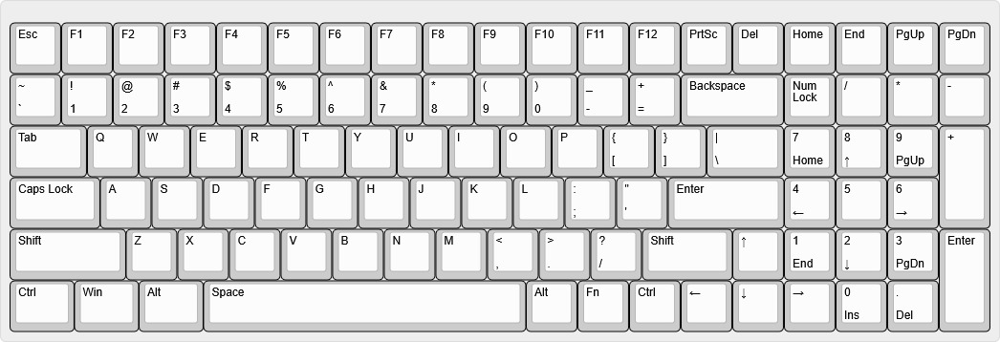
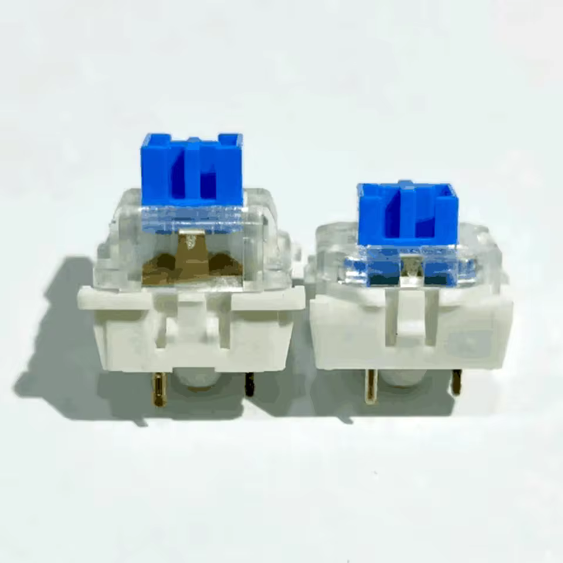

[comment]: <> (Author:  Umberto Laghi)
[comment]: <> (Contact: ul2509@gmail.com)
[comment]: <> (Github:  @ubolakes)

# :warning: WORK IN PROGRESS :warning:

# *La Jaderissima* mechanical keyboard

*La Jaderissima* is an open source mechanical keyboard designed with the intent to learn how to design a PCB.  
The repository contains all the materials necessary to build your own *La Jaderissima* at home.

Before introducing the project in more detail, I'd like to thank my friend and colleague, Biagio M., who designed the keyboard case using a 3D CAD software. Without him, I wouldn't have been able to make it.  
He also made the design as thin as possible due to my childish complaints about wanting the keyboard to be as close to the desk as possible.

[comment]: <> (TODO: add image of the final product)

## General overview
The keyboard is designed with a 96% ANSI layout to provide all the necessary keys while reducing the footprint compared to a 100% layout.

  

*Figure 1: Mechanical keyboard layout*

## Case design
The feature I desire most in a keyboard is a thin design that reduces wrist fatigue without the need for a wrist rest. A slimmer keyboard also offers a sleekwe look (I guess).

To achieve this, my friend and colleague Biagio designed an aluminum case to reduce costs, make the keyboard lighter, and allow for anodized coloring.

[comment]: <> (TODO: add render of the two case pieces from CAD)

## Keyswitch
Another design choice that makes the keyboard thinner is the use of low-profile switches. It was difficult to choose the most suitable keyswitch.

The first type of switch I chose was the Kailh Choc. The problem with them is that they are a completely custom design. Finding keycaps, stabilizers, and mechanical drawings to understand the dimensions was difficult and expensive.

After my search, I discovered the Outemu GTMX medium-profile switches. They have a lower profile than Cherry MX switches, but not as low as Kailh Choc switches. They have the same footprint as standard Cherry MX switches and are compatible with MX-specific PCBs, backplates, keycaps, and MX PCB-mounted stabilizers, which allows for a lower price.

  

*Figure 2: Cherry MX and Outemu GTMX heights compared*

[comment]: <> (TODO: add section with the BOM)

[comment]: <> (TODO: add files  for PCBWAY [and/or AISLER] and Laserboost)

